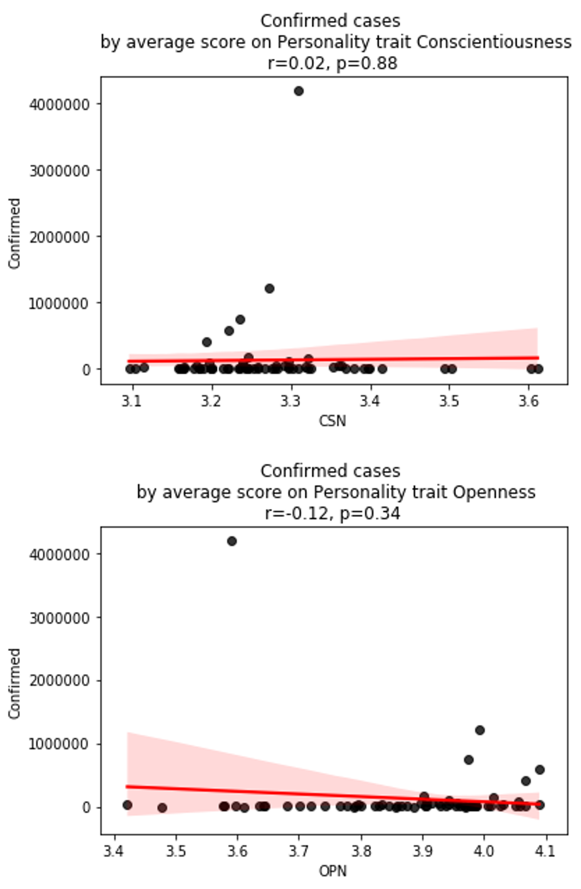
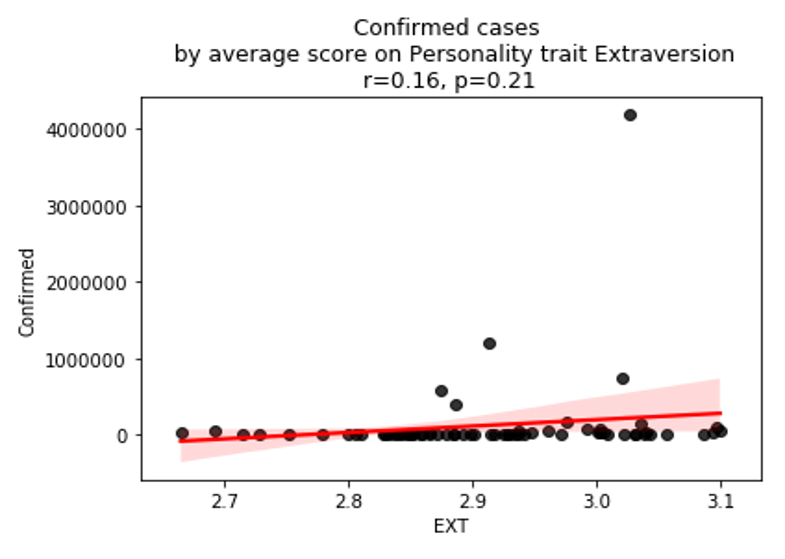
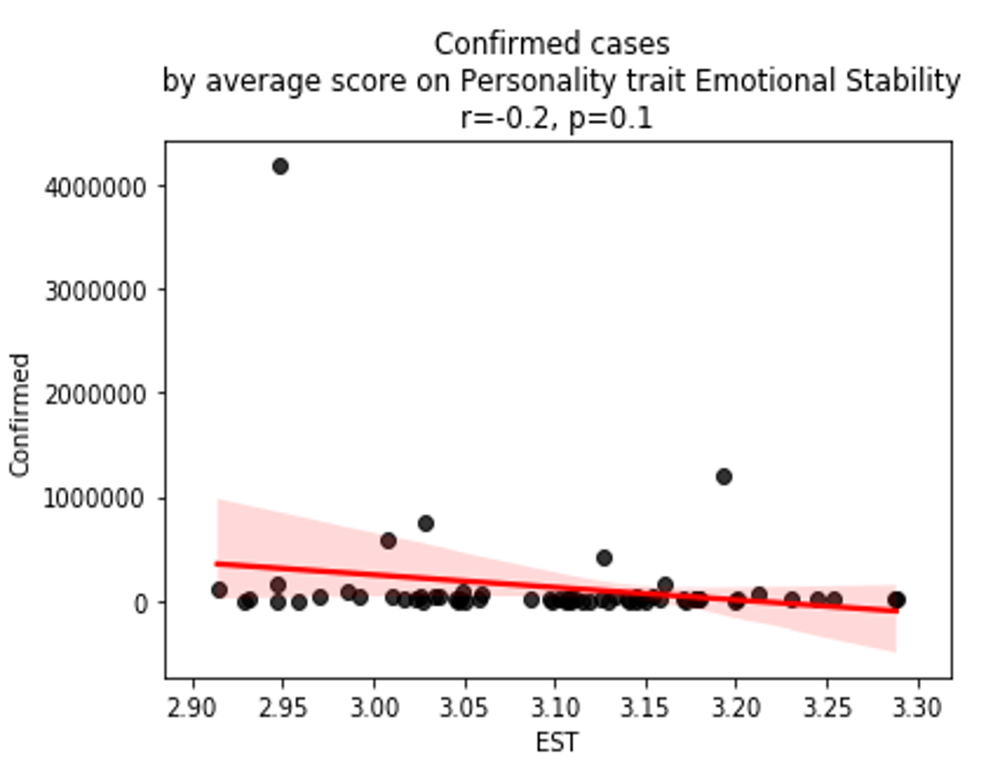
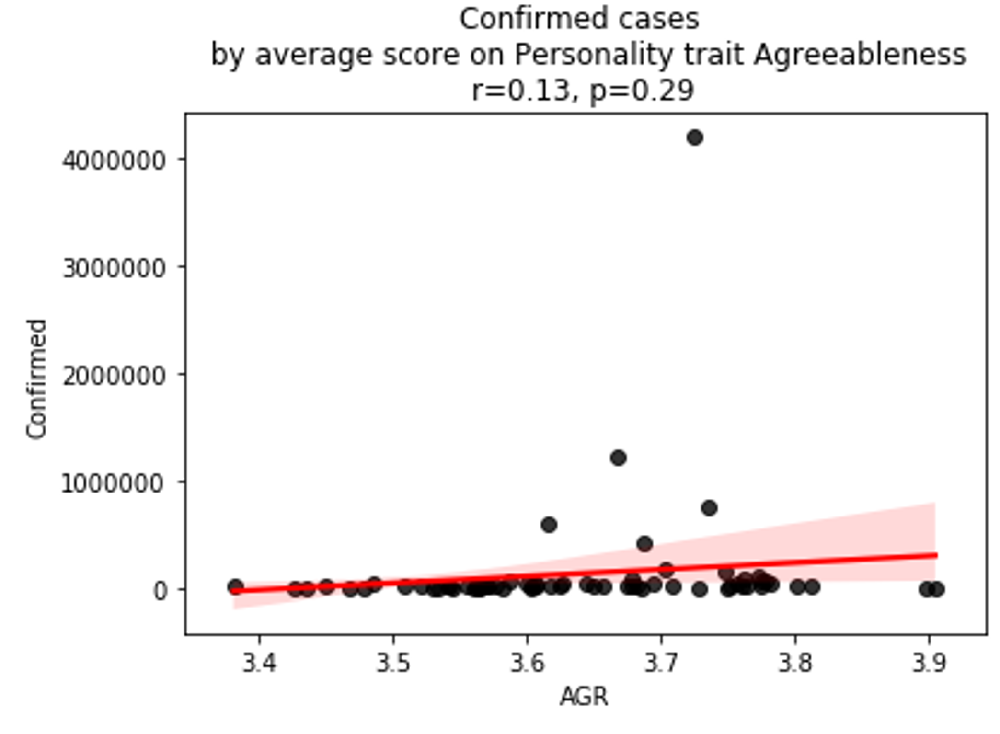

# Predicting-the-Growth-in-COVID-19-based-on-Famous-Personality-Traits

<h3>IS THE GROWTH IN COVID 19 RELATED TO FAMOUS PERSONALITY TRAITS? </h3>
<h5>Introduction:</h5>
<ul>
<li> With the outbreak of COVID 19 and the stress over the pandemic, the most attention-grabbing news on all platforms – newspaper to social media to digital was people’s behavior </li>
<li> Fighting in the aisles over toilet papers, getting abusive or racist or going into depression. There were a lot of reactions </li>
<li> Reactions are situational with a reflection of personality trait </li>
<li> A person’s personality can be influenceable but definitely cannot be changed </li>
<li>How one copes with the pandemic, therefore, is a solution that is searched internally and a person’s personality plays a major role in their behavior or reactions </li>
</ul>
<h5>Approach: </h5>
<ul>
<li> Took Data of worldwide COVID 19 results as of 28th March 2020 </li>
<li> Aggregated confirmed cases on country-level </li>
<li> Took Big 5 Personality Test data and computed country-level mean on the individual personality traits </li>
<li> Found correlation between confirmed cases and mean scores for every Personality Trait </li>
</ul>

<h5>Personality Traits:</h5>
<ul>
<li><b>OPENNESS:</b> openness to experience or preference for abstract thinking </li>
<li> <b>CONSCIENTIOUSNESS:</b> industriousness, work drive or orderliness </li>
<li> <b>EXTRAVERSION:</b> enthusiasm, assertiveness </li>
<li> <b>AGREEABLENESS:</b> compassion, politeness </li>
<li> <b>NEUROTICISM:</b> negative emotion </li>
</ul>
<h5>What do the traits signify?</h5>
<ul>
<li>The impact of the pandemic mainly is surrounding social distancing and anxiety </li>
<li>Being low on extraversion could be a beneficial and help to practice social distancing </li>
<li>If you are someone who cannot sit idle, is extremely hard working, you would be worried by the pandemic </li>
</ul>

<h5>Observations:</h5>
<ul>
<li>Countries with agreeableness score low show high growth rate. These are people at the shopping marts making sure they get more toilet roles than the guy next to them </li>
<li>Next is the country having low score in openness which also can be called emotion of disgust </li>
<li>Anxiety (EST) or negative aggression is the population fighting and walking over people in the shopping malls </li>
<li>Least confirmed cases growth by EXT </li>
</ul>

